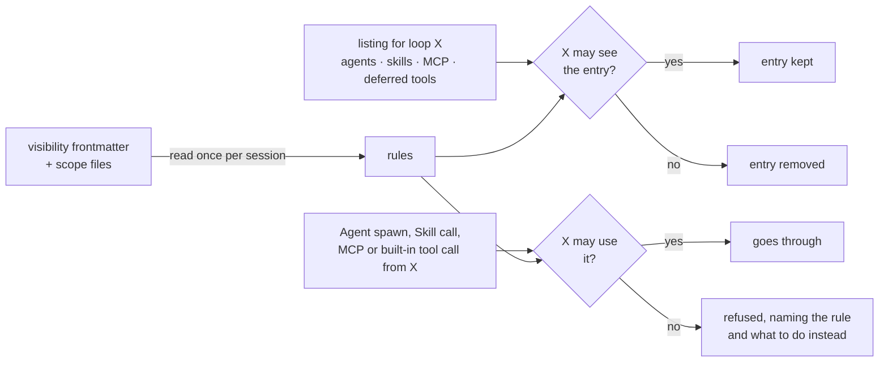

<div align="center">


# tool-visibility-controller

**Claude Code plugin for per-agent tool visibility — hide and refuse subagents, skills, MCP and built-in tools per loop**

[](https://github.com/rezzminator/tool-visibility-controller/actions/workflows/ci.yml)
[](./CHANGELOG.md)
[](./LICENSE)
[](https://code.claude.com/docs/en/plugins)
[](https://github.com/rezzminator/professor)

[Quick start](#-quick-start) · [Usage](#-usage) · [How it works](#-how-it-works) · [Limits](#️-limits) · [Changelog](./CHANGELOG.md) · [Contributing](./CONTRIBUTING.md)

</div>

One frontmatter field decides, per loop, what the main chat and each sub-agent type sees in its listings and may call:

```markdown
---
name: researcher
description: Searches the web and summarises sources.
visibility:
  visible-to:
    include: [research-lead]              # only research-lead may see and spawn this agent
  mcp:
    include: [professor/harvester_*]      # this agent's loop sees only these MCP tools
  tools:
    exclude: [Bash]                       # and every built-in tool but Bash
---
```

The main chat's agent listing, before and after:

```diff
 Available agent types for the Agent tool:
 - general-purpose: General-purpose agent for researching complex questions. (Tools: *)
 - research-lead: Plans a research question and delegates it. (Tools: Agent, Read)
-- researcher: Searches the web and summarises sources. (Tools: Read, WebFetch)
```

If the main chat dispatches `researcher` by name anyway, the spawn is refused with:

```text
Agent type researcher is not available to the main chat: visibility.visible-to in ~/.claude/agents/researcher.md admits only research-lead. Delegate the task to research-lead, or choose another agent type.
```

## 🤔 Why

- **Every loop gets the tools its job needs, not all of them.** Claude Code lists every agent, skill, MCP tool and deferred tool to every loop. A helper agent, a dangerous MCP server or a heavy skill now shows up only where you allow it.
- **Hidden and refused, not just hidden.** Each listing is filtered per loop, and a call by name from a loop that may not use the item is refused with a message naming the rule and what to do instead.
- **Parent → child chains keep working.** `permissions.deny` blocks a tool in every loop, the orchestrator included. Here the rule is per caller: `research-lead` spawns `researcher`, the main chat cannot.
- **Things you do not own are covered too.** Built-in agents (`Explore`), plugin agents and skills, MCP servers and built-in tools take their rules from a scope file, `tool-visibility-controller.json`.
- **Every other loop's context gets lighter, and the prompt cache holds.** A hidden entry leaves the listing; every other byte stays identical.
- **It never blocks your work by accident.** Any error is logged and the listing, the call and the spawn go on as they were.

## 🚀 Quick start

Function hooks are experimental; turn them on before Claude Code starts:

```bash
export CLAUDE_CODE_ENABLE_FUNCTION_HOOKS=1
```

Install from the repository's own marketplace:

```bash
claude plugin marketplace add rezzminator/tool-visibility-controller
claude plugin install tool-visibility-controller@tool-visibility-controller
```

<details>
<summary>One step, or from inside a session</summary>

Where `claude plugin install --help` lists `--marketplace`, one command adds the marketplace and installs:

```bash
claude plugin install tool-visibility-controller --marketplace rezzminator/tool-visibility-controller
```

Inside a session:

```text
/plugin marketplace add rezzminator/tool-visibility-controller
/plugin install tool-visibility-controller@tool-visibility-controller
```

</details>

Add a `visibility` field to an agent, skill or command you own, or write a scope file, and start a new session.

## 🧭 Usage

### The `visibility` field

In the frontmatter of an agent (`agents/*.md`), a skill (`skills/*/SKILL.md`) or a command (`commands/**/*.md`):

```yaml
visibility:
  visible-to:            # who may see and invoke THIS item
    include: [rr, rr-pro, main]          # only these loops; main is the main chat
    exclude: []                          # every loop but these
  agents:                # what THIS agent's own loop sees (agent files only)
    include: [sub-rr]
  skills:  { exclude: [deploy, ops:*] }  # skills and model-invocable commands
  mcp:     { include: [professor/harvester_*] }   # server, or server/tool
  tools:   { exclude: [WebFetch, Bash] }          # built-in tools by name
```

- Every block and both keys are optional; an absent block restricts nothing. `include` keeps only matches, `exclude` drops matches, both together keep the included minus the excluded.
- A pattern is an exact name or a `*` glob. A loop is `main` or an agent type (`Explore`, `plugin:agent`).
- MCP patterns are `server` or `server/tool`, the server as configured (`claude.ai Docs/*` matches `mcp__claude_ai_Docs__*`), or a full `mcp__server__tool`.
- Skill patterns match the listed name (`plugin:skill`) or the bare name after the plugin.
- `agents`, `skills`, `mcp` and `tools` count only in agent files: a skill or command has no loop of its own. In a skill or command they are logged and ignored.

### The scope file

For what has no frontmatter you own: the main chat, built-in agents, plugin agents and skills, MCP servers, built-in tools. `$CLAUDE_CONFIG_DIR/tool-visibility-controller.json` (else `~/.claude/tool-visibility-controller.json`) and `.claude/tool-visibility-controller.json` in the session's directory and each directory above it, below your home directory:

```json
{
  "loops": {
    "main":    { "mcp": { "exclude": ["professor/harvester_*"] }, "agents": { "exclude": ["Explore"] } },
    "Explore": { "tools": { "exclude": ["WebFetch"] } }
  },
  "items": {
    "agents": { "Explore": { "visible-to": { "exclude": ["main"] } } },
    "skills": { "docs-kit:pdf": { "visible-to": { "include": ["writer"] } } },
    "mcp":    { "professor/harvester_*": { "visible-to": { "exclude": ["main"] } } },
    "tools":  {}
  }
}
```

- `loops.<loop>` holds the same set blocks as an agent's `visibility`; `items.<set>.<pattern>` holds a `visible-to`.
- A nearer file replaces a farther one key by key (`loops.main.mcp`, `items.agents.Explore`), the user file being the farthest.

### Who may use what

A loop may see and invoke an item only when every rule agrees: the item's `visible-to` admits the loop, the loop's own block for that set admits the item, and the scope file admits both. Any one says no, and the item is hidden from that loop and its call refused.

- Definitions are read from `$CLAUDE_CONFIG_DIR` (else `~/.claude`) and from `.claude/` in the session's directory and each directory above it, below your home directory as Claude Code reads them; the nearest definition of a name wins, so a project copy without `visibility` lifts the user copy's rules there.
- Everything is read once per session. Start a new session after an edit.
- A malformed block (a scalar where a list belongs, an unknown key, an unclosed list, a key given twice) is logged with its file and the reason, and only that block is ignored.

Remove it with:

```bash
claude plugin uninstall tool-visibility-controller@tool-visibility-controller
```

## 🧠 How it works



| Hook | What it does |
| --- | --- |
| `prompt.attachment` | Per loop, removes the entries that loop may not see from the agent listing (`agent_listing_delta`), the skill listing (`skill_listing`) and the deferred-tools notice (`deferred_tools_delta`), and drops an MCP server's block from `mcp_instructions_delta` when the loop may use none of that server's tools. The loop is the main chat, or a sub-agent whose type comes from its id in the session's agent list. Every other byte stays as it was. |
| `agent.spawn` | Refuses the spawn of an agent type the calling loop may not use. |
| `tool.call` | Refuses a built-in tool, an MCP tool, or a `Skill` call naming a skill or command the calling loop may not use. |
| `session.start` | Forgets the rules read for the previous session. |

It fails open: an unreadable file, a loop id that names no agent, a hook that throws or overruns its budget, or any other error is logged with its context and leaves the listing, the call and the spawn as they were.

## ⚠️ Limits

- Requires function hooks (`CLAUDE_CODE_ENABLE_FUNCTION_HOOKS=1`); tested live on Claude Code 2.1.295, which CI validates against.
- A tool whose schema sits in the prompt's tool list (built-in tools such as `Bash` and `Read`, and every MCP tool when tool search is off) cannot be hidden per loop: Claude Code renders tool schemas once per session for every loop. Such a tool stays listed; its call is refused. Deferred tools, listed by name behind ToolSearch, are hidden per loop. Tool search is on by default against Anthropic's API and off behind a custom `ANTHROPIC_BASE_URL`; `ENABLE_TOOL_SEARCH=true` turns it on.
- ToolSearch can still load a hidden deferred tool's schema when asked for it; the call is refused.
- A sub-agent receives the agent listing with its second request, after its first tool call. Refusals apply from its first request.
- A slash command the person types runs: only the model's `Skill` calls are checked.
- An MCP server's instructions are dropped only when the session knows its tools and the loop may use none of them. A `## ` heading inside a server's instructions reads as the next server's heading, so the text below it stays: the listing does not tell the two apart, and guessing would drop another server's instructions.
- A hidden skill's entry is removed up to the first blank line in its description; a description holding a blank line leaves its rest in the listing, since a skill entry marks no end of its own.
- Plugin-provided agents, skills and commands are not read for `visibility`; rule them in the scope file.
- It is a convenience, not a security boundary: it fails open. Use `permissions.deny` for a tool that must never run.

## ❓ FAQ

**Does it cost anything?** Once per session, one directory listing per definitions directory and one read per definition and scope file. Per listing or call, one lookup in the session's agent list for a sub-agent's type, skipped when no rule speaks about that set. It makes no model call and no network request, and writes no file.

**Why not `permissions.deny`?** It blocks a tool in every loop, the parent's included, and leaves the listing as it was. This plugin hides and refuses per caller.

**Why not a `tools:` list in the agent?** Use it where it fits: it limits that agent's own tools and takes their schemas out of its prompt. It cannot limit the main chat or a built-in agent, nor which agents and skills a loop is offered, and it cannot keep other loops from calling the agent. The two combine.

## 💬 Help

Questions and bugs go to [issues](https://github.com/rezzminator/tool-visibility-controller/issues/new/choose); [SUPPORT.md](./SUPPORT.md) says what to include. Security problems: [SECURITY.md](./SECURITY.md), never a public issue.

## 🤝 Contributing

[CONTRIBUTING.md](./CONTRIBUTING.md) covers the layout, the gates and where a change goes; open issues labelled [good first issue](https://github.com/rezzminator/tool-visibility-controller/issues?q=is%3Aissue+is%3Aopen+label%3A%22good+first+issue%22) are a place to start. Everyone taking part follows the [Code of Conduct](./CODE_OF_CONDUCT.md).

## 🎓 Built with Professor

tool-visibility-controller is built and maintained with [Professor](https://github.com/rezzminator/professor), a fleet controller and discipline layer for Claude Code, Codex and OpenCode: chats that message each other, agents held to the project's rules, and gated releases. This plugin came out of it: Professor's orchestrators ship helper agents, skills and research tools meant only for them, and this plugin keeps each one in the loops that need it.

## License

[MIT](./LICENSE)
