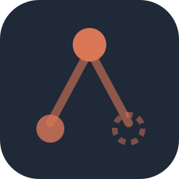
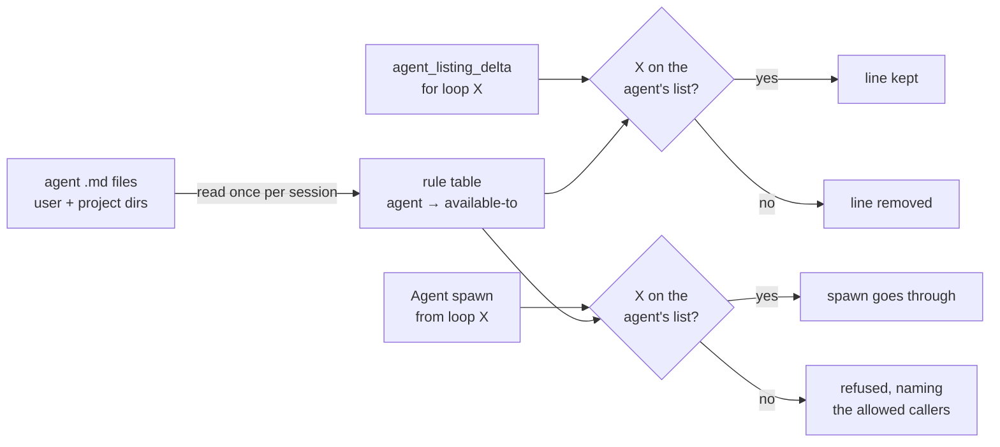

<div align="center">



# agent-scope

**Claude Code plugin for parent-scoped subagents — hide a helper from every other agent listing and refuse its dispatch**

[](https://github.com/rezzminator/agent-scope/actions/workflows/ci.yml)
[](./CHANGELOG.md)
[](./LICENSE)
[](https://code.claude.com/docs/en/plugins)
[](https://github.com/rezzminator/professor)

[Quick start](#-quick-start) · [How it works](#-how-it-works) · [Limits](#️-limits) · [Changelog](./CHANGELOG.md) · [Contributing](./CONTRIBUTING.md)

</div>

One line of frontmatter makes a sub-agent belong to its orchestrator:

```markdown
---
name: sub-tracer
description: Follows one thread of code for a tracer.
tools: Read, Grep, Glob, Bash, Agent
available-to: [tracer, sub-tracer]
---
```

The main chat's agent listing, before and after:

```diff
 Available agent types for the Agent tool:
 - general-purpose: General-purpose agent for researching complex questions. (Tools: *)
-- sub-tracer: Follows one thread of code for a tracer. (Tools: Read, Grep, Glob, Bash, Agent)
 - tracer: Answers numbered questions from code. (Tools: Read, Grep, Glob, Bash, Agent)
```

A `tracer` loop still lists `sub-tracer` and spawns it. If the main chat dispatches it by name anyway, the spawn is refused with:

```text
sub-tracer is available only to tracer or sub-tracer (its available-to list); the main chat cannot dispatch it. Delegate the task to tracer or sub-tracer, or choose another agent type.
```

## 🤔 Why

- **Helpers stop getting called with the wrong brief.** Claude Code lists every agent to every loop, so the main chat and unrelated sub-agents see an orchestrator's helper and sometimes call it directly. A scoped helper is seen and spawned only by the parents you name.
- **Parent → child chains keep working.** `permissions.deny: ["Agent(sub-tracer)"]` hides the agent and blocks it in every loop, the orchestrator included. `available-to` decides per caller.
- **Claude Code has no field for this.** Its sub-agent frontmatter has no "who may call me" key, an `Agent(type)` allowlist in a sub-agent's `tools` is ignored, and an unknown key is silently dropped ([sub-agent docs](https://code.claude.com/docs/en/sub-agents)). agent-scope reads the key Claude Code ignores.
- **Every other loop's context gets lighter.** A hidden agent's line leaves the listing of every loop not on its list, and the rest of the listing stays byte-for-byte identical, so the prompt cache holds.
- **It never blocks your work by accident.** Any error is logged and the listing and the spawn go on as they were. An agent without `available-to` is untouched.

## 🚀 Quick start

Function hooks are experimental; turn them on before Claude Code starts:

```bash
export CLAUDE_CODE_ENABLE_FUNCTION_HOOKS=1
```

Install from the repository's own marketplace:

```bash
claude plugin marketplace add rezzminator/agent-scope
claude plugin install agent-scope@agent-scope
```

<details>
<summary>One step, or from inside a session</summary>

Where `claude plugin install --help` lists `--marketplace`, one command adds the marketplace and installs:

```bash
claude plugin install agent-scope --marketplace rezzminator/agent-scope
```

Inside a session:

```text
/plugin marketplace add rezzminator/agent-scope
/plugin install agent-scope@agent-scope
```

</details>

Add `available-to` to an agent you own, in `~/.claude/agents/` or a project's `.claude/agents/`, and start a new session. The main chat's agent listing no longer shows it.

## 🧭 Usage

```yaml
available-to: [scope-parent]          # one parent
available-to: [tracer, main]          # main is the main chat
available-to:                         # a block list works too
  - tracer
  - sub-tracer
available-to: []                      # nobody: hidden everywhere, every dispatch refused
```

- A scoped agent is visible to, and spawnable by, exactly the agent types its list names; `main` is the main chat.
- Definitions are read from `$CLAUDE_CONFIG_DIR/agents` (else `~/.claude/agents`) and from `.claude/agents/` in the session's directory and each directory above it. A project definition replaces a user one of the same name, and the nearest project directory wins, so a project copy without `available-to` unscopes the agent there.
- Definitions are read once per session. Start a new session after editing an `available-to` list.
- A malformed `available-to` (a scalar, an unclosed list, an item that is not a name) is logged and the agent treated as unscoped.

Remove it with:

```bash
claude plugin uninstall agent-scope@agent-scope
```

## 🧠 How it works



| Hook | What it does |
| --- | --- |
| `prompt.attachment` | On the agent listing (`agent_listing_delta`), removes the line of every scoped agent the receiving loop may not spawn. The loop is the main chat, or a sub-agent whose type comes from its id in the session's agent list. Every other byte stays as it was. |
| `agent.spawn` | When the dispatched type is scoped and the calling loop is not on its list, refuses the spawn with a message naming who may spawn it. Hiding alone would not stop a dispatch by name. |
| `session.start` | Forgets the definitions read for the previous session. |

It fails open: an unreadable definition, a loop id that names no agent, a hook that throws or overruns its budget, or any other error is logged with its context and leaves the listing and the spawn as they were.

## ⚠️ Limits

- Requires function hooks (`CLAUDE_CODE_ENABLE_FUNCTION_HOOKS=1`); tested live on Claude Code 2.1.295, which CI validates against.
- A sub-agent receives the agent listing with its second request, after its first tool call. A sub-agent that dispatches on its very first request has seen no listing, scoped or not; the spawn check still applies.
- Plugin agents (`plugin:name`) and built-in agents such as `Explore` cannot be scoped: only definitions in the user and project agent directories are read.
- Edits to an `available-to` list take effect in the next session.

## ❓ FAQ

**Does it cost anything?** One directory listing per agent directory and one read per definition, once per session. Per listing, one lookup in the session's agent list for a sub-agent's type, skipped when no definition is scoped. It makes no model call and no network request, and writes no file.

**Why not `permissions.deny`?** It hides the agent and blocks the spawn in every loop, the parent's included. agent-scope hides and refuses per caller.

## 💬 Help

Questions and bugs go to [issues](https://github.com/rezzminator/agent-scope/issues/new/choose); [SUPPORT.md](./SUPPORT.md) says what to include. Security problems: [SECURITY.md](./SECURITY.md), never a public issue.

## 🤝 Contributing

[CONTRIBUTING.md](./CONTRIBUTING.md) covers the layout, the three gates and where a change goes; open issues labelled [good first issue](https://github.com/rezzminator/agent-scope/issues?q=is%3Aissue+is%3Aopen+label%3A%22good+first+issue%22) are a place to start. Everyone taking part follows the [Code of Conduct](./CODE_OF_CONDUCT.md).

## 🎓 Built with Professor

agent-scope is built and maintained with [Professor](https://github.com/rezzminator/professor), a fleet controller and discipline layer for Claude Code, Codex and OpenCode: chats that message each other, agents held to the project's rules, and gated releases. This plugin came out of it: Professor's orchestrators ship helper agents meant only for them, and this plugin keeps those helpers out of every other loop.

## License

[MIT](./LICENSE)
